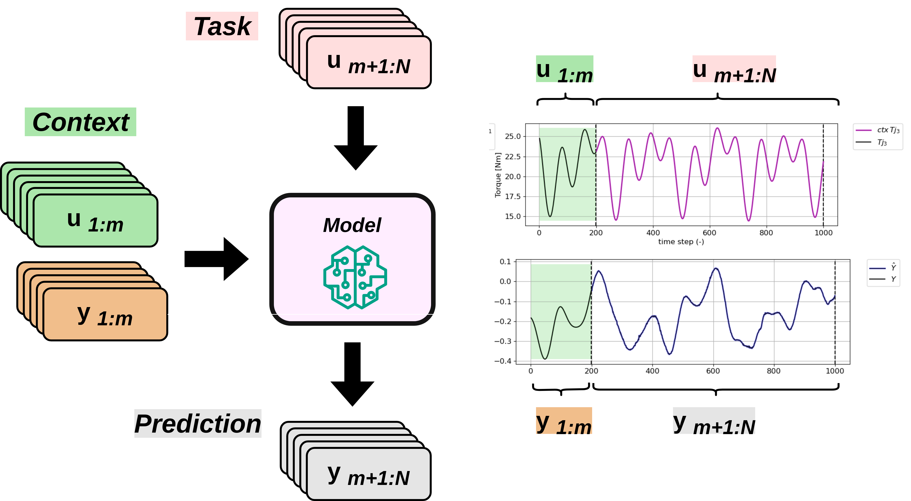
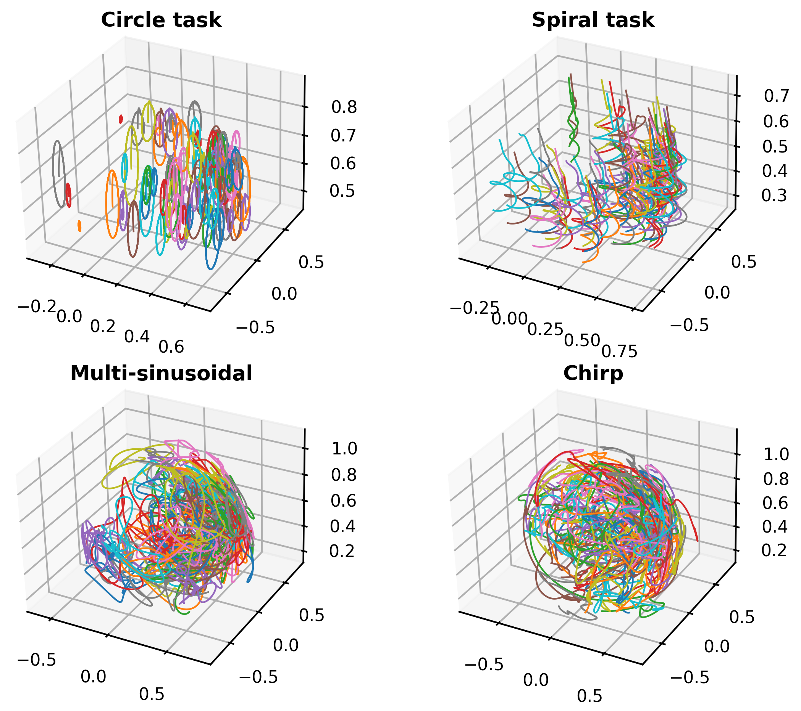
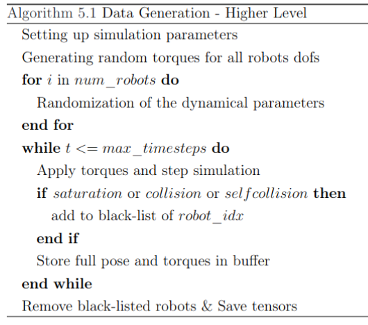
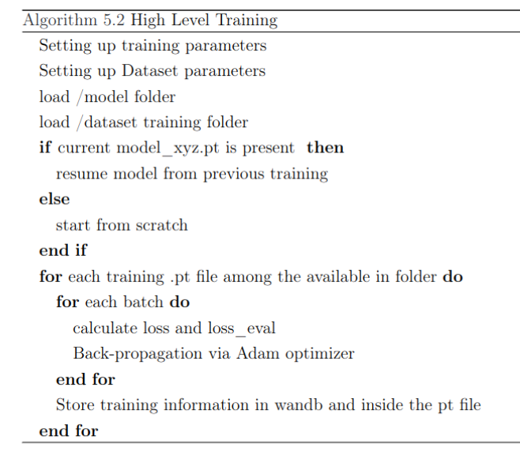

# RoboMorph: In-context meta-learning for robot dynamics modeling

These are the Python scripts to reproduce the results of the paper: 
[---].
This work is the continuum of
[In-context learning for model-free system identification](http://arxiv.org/abs/2308.13380)
by Marco Forgione, Filippo Pura and Dario Piga.

They introduced the concept of model-free in-context learning for System Identification, where a *meta model* is trained to describe an entire class of dynamical systems, instead of a single instance. The meta model is able to understand the underlying dynamics from a context of provided input/output samples and to 
perform a task such as one-step-ahead prediction or multi-step-ahead simulation, that would otherwise require a model trained on each particular dataset.

Encoder-decoder (machine-translation-like) Transformer architecture for model-free multi-step-ahead simulation:


As a natural increase of complexity, this Framework has been applied to a Robotic arm system identification task. As an example, the modularity of the propesed structure can be adapted and exploited to whataver Space mapping. In the example case, we mapped from Dynamic to Kinematic space.

- **Input**: Dynamic dofs' joint torques in [Nm]
- **Output**: Kinematic quantities of interest
    - *EE Cartesian coordinates* $(x,y,z)$
    - *EE Quaternion* ($X,Y,Z,W$)
    - *dofs position* ($q_0 \dots q_i$)
- **Context**: Is the portion of the entire simulation that establish the correlation between input and outputs.
- **Total time window**: 1000 steps

This framework has been applied to Panda Franka Robotic Arm.


 

# Repository organization
```bash
├── Auxiliar
├── data_generation
├── Images
├── README.md
├── ROS_code
├── Shell_scripts
└── Transformer_for_isaac
```

## Managing simulations

### [data_generation](data_generation)

* [generation_franka.py](data_generation/generation_franka.py)
* [generation_kuka.py](data_generation/generation_franka.py)


Each simulation is characterized by a certain name, representing its peculiarity.\
These are examples of files.

### Numerical Random Torques

*733_envs_3979_steps_1000_f_0_1_MS_rand_1010_bounds_mass_15_15.pt*

- **NNN**: generated seed for reproducibility
- **_envs_**: number of valid simulations
- **steps**: number of time steps
- **f**: the base frequency of the control action (which is manipulated internally by the function)
- **_input_**: type of input: MS, CH, COMB (Multi-sinusoidal, chirp, combination)
- **_rand_**: boolean variables translated in 0/1.
  - For example, the case below produces the string "_random_1010":
    - `random_initial_positions` = True (1)
    - `random_stiffness_dofs` = False (0)
    - `random_masses` = True (1)
    - `random_coms` = False (0)
- **_bounds_mass**: 5_5 in % (±5% of the nominal value)

### OSC (Operational Space Control)
*210_envs_3535_steps_1000_osc_VS_1010_bounds_mass_10_10.pt.pt*

Most of the naming rules are identical to the ones for the synthetic torques, except for the input type which is absent and replaced by "osc_" + type of osc task.

## Managing trainings

### [Transformer_for_isaac](Transformer_for_isaac)

* [train_sim_multiple_seeds.py](Transformer_for_isaac/train_sim_multiple_seeds.py): Encoder-decoder Transformer for multi-step-ahead simulation.

* [TEST_single_model.py](Transformer_for_isaac/TEST_single_model.ipynb)

The scripts above except accept command-line arguments to customize the architecture and aspects of the training. 
For instance, the large one-step-ahead Transformer for the WH class described in the paper may be trained with the command:

```
python train_sim_multiple_seeds.py --n-layer 12 --n-head 12 --n-embd 192 --batch-size 16
```


## Model Training and Dataset Management
Each family of models trained on the same dataset is generally collected in the same folder (e.g., out_ds1). This process is not automated for individual models, so during training, the dataset identifier (e.g., ds2) must be manually added to the model name.
Manually managing model names and dataset identifiers requires careful attention to ensure consistency and avoid errors, especially when resuming training. 


### How to Test a model after training
```
ckpt_partition_20_batch16_embd192_heads8_lay12_MSE.pt
```

It must be renamed with dataset-suffix identifier:

```
ckpt_partition_20_batch16_embd192_heads8_lay12_MSE_ds1.pt
```
Copy and rename `traning_dataset_list.txt` located in [data_generation](data_generation) as `traning_ds1_list.txt` file inside [Transformer_for_isaac](Transformer_for_isaac).

All test file will search inside this txt file and will consider the tests  in three categories: ID, OOD, Validation (When the seed are also equal).

### How to update training - Fine tuning

If the reader wants to update the trained model, he needs to put 
'training_dataset_list.txt' inside [data_generation](data_generation) folder to update the txt file with the new simulation records. 
Moreover, if the model has been already renamed with the dataset suffix, the dataset identifier must be removed and manually update.

Why is this  necessary? Inside [train_sim_multiple_seeds.py](Transformer_for_isaac/train_sim_multiple_seeds.py) it is specified the nomenclature which will be searched inside the specified folder (out_model).

`cfg.in_file = f"{cfg.out_file}_partition_{round(partition*100)}_batch{cfg.batch_size}_embd{cfg.n_embd}_heads{cfg.n_head}_lay{cfg.n_layer}_{cfg.loss_function}"`

#### Example
I have a certain model `ckpt_partition_20_batch16_embd192_heads8_lay12_MSE_ds1.pt`  
located in `Transformer_for_isaac/out_ds1`  
with a txt file located in `data_generation/training_ds1_list.txt`

I want to train-fine tuning on a certain dsX.

In order to correctly update the same model, it is necessary to rename such as:
`ckpt_partition_20_batch16_embd192_heads8_lay12_MSE.pt`  
is located in `Transformer_for_isaac/out_dsX`    
with the same txt file located in `data_generation/training_dataset_list.txt`  

then Launch (ATTENTION to the parameter: --model-dir "out_dsX")

```
source simulate_and_train.sh
```
In `simulate_and_train.sh` is possible to save some intermediates versions, depending on the dimension of simulation blocks.
Use wandb as register to keep trace.  
https://wandb.ai/home

Once the simulations-trainings will have been finished, the same file needs to be renamed as: 


### [shell_script](shell_script)

In this folder, is possible to train and generate datasets adjusting whatever the user needs ([simulate_and_train.sh](shell_script/simulate_and_train.sh)). Using _source_ allows to activate and deactivate different conda environments from shell scripts.

```
source simulate_and_train.sh
```
In order to better understand the logic behind this framework, the high level structure could ehnance the code interpetability.

 
  <br>
<br>

Due to dimension issues, when launching [simulate_and_train.sh](Shell_scripts/simulate_and_train.sh) we are deleting dataset training folder. All the simulations previously used for trainign are stored inside the txt file, which can be updated in each training session.


### [Auxiliar](Auxiliar)

* [3D_visualization](data_generation/3D_visualization) This folder contains ipynb to plot 3D coordinates in space, visualizing End Effectors' poses in space.

* [Plot_loss_from_Wandb](data_generation/Plot_loss_from_Wandb) This folder contains some example of training data.


# Additional information

The first time step of control action is set for each joint to 0.
For the training part, this first step is excluded. 
It is necessary for the reproducibility in IsaacGym, taken into account the same randomizations.


```
@ torch.no_grad()
def loading():
    if loaded['control_action'].shape[0] == seq_len + 1:
        control_action_extracted = loaded['control_action'][skip + 1:,:test_cfg.num_test,:7] #time x num_envs x dofs
    else:
        control_action_extracted = loaded['control_action'][skip:,:test_cfg.num_test,:7]
    position_extracted = loaded['position'][skip:,:test_cfg.num_test,:]

    position = torch.movedim(position_extracted.to('cpu'),-2,-3)
    control_action = torch.movedim(control_action_extracted.to('cpu'),-2,-3)
    return control_action,position
```
_sim_params.dt_ is the time unit for the acquisition: it can be changed, but pay attention to [trajectory_generator.py](data_generation/trajectory_generator.py) and consistency in terms of Hz and frequency (line 12).
Inside [trajectory_generator.py](data_generation/trajectory_generator.py), some major numerical values can be adjusted for the entity of the randomness depending on the working frequency.

```
gym = gymapi.acquire_gym()

# Configure sim
type_of_contact = gymapi.ContactCollection.CC_LAST_SUBSTEP 

sim_params = gymapi.SimParams()
sim_params.up_axis = gymapi.UP_AXIS_Z
sim_params.gravity = gymapi.Vec3(0.0, 0.0, -9.8)
sim_params.dt = 1.0/60 
sim_params.substeps = 2
```

# Installation and requirements

### Isaac Gym rlgpu dataset environment

Download the Isaac Gym Preview 4 release from the website (https://developer.nvidia.com/isaac-gym), then follow the installation instructions in the documentation. We highly recommend using a conda environment to simplify set up. 

### Robomorph training environment

With the setup of NVIDIA Isaac Gym, a conda environment called rlgpu should be added automatically during set-up steps.

```
conda env create -f robomorph.yml
```

## Hardware requirements
While all the scripts can run on CPU, execution may be frustratingly slow. For faster training, a GPU is highly recommended.
To run the paper's examples, we used a Desktop Computer equipped with an NVIDIA RTX 4090 GPU.


# Citing

If you find this project useful, we encourage you to:

* Cite the [paper]() 
```
